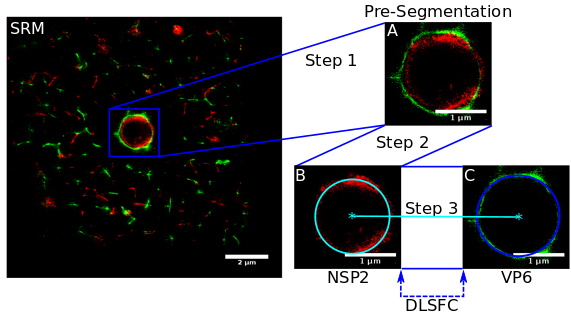

# Nanoscale-organization-of-rotavirus-replication-machineries

## Abstract
Rotavirus genome replication and assembly take place in cytoplasmic electron dense inclusions termed viroplasms (VPs). Previous conventional optical microscopy studies observing the intracellular distribution of rotavirus proteins and their organization in VPs have lacked molecular-scale spatial resolution, due to inherent spatial resolution constraints. In this work we employed super-resolution microscopy to reveal the nanometric-scale organization of VPs formed during rotavirus infection, and quantitatively describes the structural organization of seven viral proteins within and around the VPs. The observed viral components are spatially organized as 5 concentric layers, in which NSP5 localizes at the center of the VPs, surrounded by a layer of NSP2 and NSP4 proteins, followed by an intermediate zone comprised of the VP1, VP2, VP6. In the outermost zone, we observed a ring of VP4 and finally a layer of VP7. These findings show that rotavirus VPs are highly organized organelles.    

## General Information
Super-resolution microscopy reveals, at nanometric-scale, the highly organized protein structure of viroplasms, the viral factories used by rotavirus to replicate its genome and assemble new viral particles .
This repository collects all the source codes used to carry up this research. This research was published in eLife ([link to the article](https://elifesciences.org/articles/42906)) and can be cited as:    

***Garcés et al. Nanoscale organization of rotavirus replication machineries. eLife 2019;8:e42906. https://elifesciences.org/articles/42906, doi: 10.7554/eLife.42906.***

## Structure of this Repository
This repository is organized in 5 directories, which contains the source codes to complete specific sections of our research, these are:   
1. **Algorithm Validation**: For the validation, we simulated the spatial distribution of viral elements as circumferences, for which we know their parametric form ("ground truth" dataset). The use of "ground truth" allows us to quantify the error in the adjustment of the algorithm DLSFC at different noise levels and partial oclussion angles. The algorithm DLSFC was compared with other two approaches proposed by [Gander et al. 1994](http://yoinsider.net/redir/icP8Lm0RUQ4Z_mLo0_OqP0Wa4duBvtDyHXHlKZXO9WHzwR3YGQtsBJynuCYrF8iBcMOkqyVNugnXd4iLRBlTpAhgudJNrddursNPIWr6nwMk9wvBDPQOod6PpnOakUeT7QXF9EBrKdY3jLN14U6FWvbyqXbnJSngzydRkA82qOvyzQs5TQwri2-b4YAF-JGQ5Oq8Slo9K1NPmHsUZxrQmK5OPJNUkRvkbD_zJM3wQK2HXu8Kh3-K4bnNUR-0ewc1kIDUDmY-h4VI_RXmBbXjQuy8u4bjHTibCNYz9CM-FXQJnPsZm33nhdH8YFtMFw86NP0-g3IEL4IqZe_6y0ekoGTbuHe5h7-XQZMymC3oGgqggbEq94Xs8w7q4YD4WLPmti3jg6SwBvz1OE8drlqg9N7uycff-IxqX1PM0ABIvHtrUGc=). For more details see the README file into this directory.     
2. **Circumference Hypothesis Validation**: To proof the hypothesis that the viral elements of the VPs can be approximated through circumferences, we carried up a series of experiments based on the comparison between the circumference obtained by the algorithm DLSFC, and a least squared ellipse resulting of the "Direct Least Square Fitting Ellipse" (DLSFE) algorithm ([Fitzgibbon et al., 1999](https://ieeexplore.ieee.org/document/765658)). For more details see the README file into this directory.     
3. **Concentricity Hypothesis Validation**: The functions in this directory allow carry up to a study to validate the viral elements concentricity hypothesis based on the distance between the centers of the adjusted circumferences of both proteins. For more details see the README file into this directory.     
4. **Automatic Image Processing**: This directory contains all the functions to run the unsupervised analysis of the images through the algorithm Vp-DLSFC (see the figure below which is also the [Figure 1 in the Appendix 1 of our article](https://elifesciences.org/articles/42906)). For more details about the functions included in this directory see the README file into it.    
    
**Figure**: *Scheme of the “Viroplasm Direct Least Square Fitting Circumference” algorithm (VPs-DLSFC). SRM) Complete SRM image; A) Manual pre-segmentation step, an expert selects and isolates each viroplasm as a single image; B) Fit a circumference to the reference protein through the algorithm DLSFC; C) The center of the reference protein is taken as the center of the accompanying protein, and then the radius of the adjust circumference for this second protein is computed.*      
5. **R Codes**: It includes all the R source codes for the statistical analysis. For more details consult the README file into this directory.

